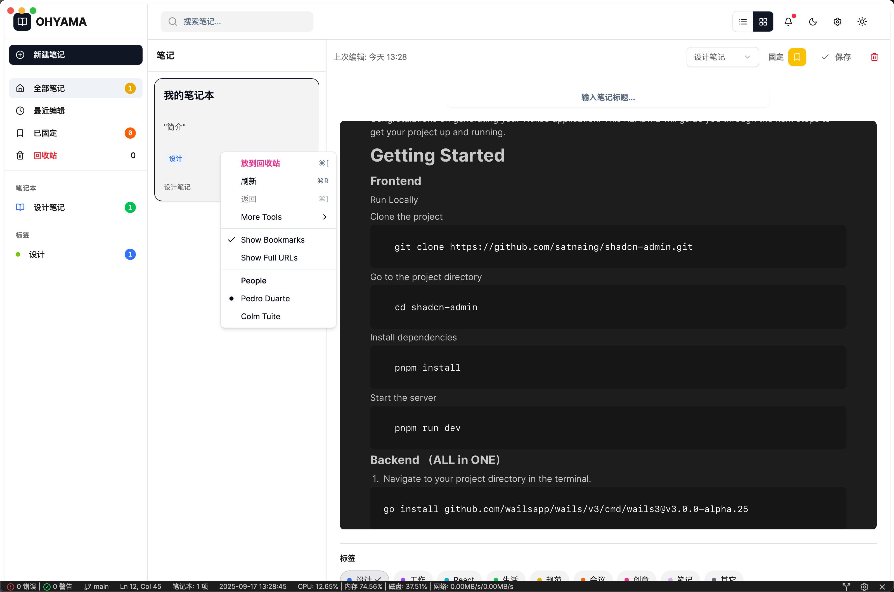

# 简介



本项目是一个基于Wails3的跨平台桌面笔记本应用，集成了前端React、后端Go、以及中间件PocketBase，旨在提供一个功能丰富且易于扩展的桌面应用解决方案。后端纯Go语言编写，支持独立二进制文件运行，无环境依赖，支持多平台交叉编译，方便部署和分发。

项目包含用户管理、权限控制、数据存储等功能模块，适用于各种桌面应用场景。

项目采用最新最火爆的Shadcn UI组件库，结合Tailwind CSS，提供现代化的用户界面设计和响应式布局。前端使用Vite进行构建和开发，确保快速的开发体验和高效的性能。后端采用Gin和Hertz框架，结合GORM进行数据库操作，确保应用的稳定性和扩展性。数据存储方面，选择轻量级的SQLite数据库，适合桌面应用的需求。

希望本项目能为开发者提供一个良好的起点，帮助他们快速构建功能完善的跨平台桌面应用。

# 技术架构

* 前端：React + Vite + TypeScript + Shadcn UI + Shadcn-admin + Tailwind CSS
* 后端：Go + Gin + Hertz + XORM + SQLite
* APP桌面端：Wails3
* 中间件: PocketBase
* 笔记本UI组件：TipTap + BlockNote

# Welcome to Your New Wails3 Project!

Congratulations on generating your Wails3 application! This README will guide you through the next steps to get your project up and running.

## Getting Started

### Frontend

#### Run Locally

Clone the project

```bash
  git clone https://github.com/satnaing/shadcn-admin.git
```

Go to the project directory

```bash
  cd shadcn-admin
```

Install dependencies

```bash
  pnpm install
```

Start the server

```bash
  pnpm run dev
```

### Backend （ALL in ONE）

1. Navigate to your project directory in the terminal.

   ```
   go install github.com/wailsapp/wails/v3/cmd/wails3@v3.0.0-alpha.25
   ```

2. To run your application in development mode, use the following command:

   ```
   wails3 dev
   ```

   This will start your application and enable hot-reloading for both frontend and backend changes.

3. To build your application for production, use:

   ```
   wails3 build
   ```

   This will create a production-ready executable in the `build` directory.

## Use Release

下载对应平台的预编译版本，解压后直接运行主程序即可，无需安装任何依赖环境。  
例如在Windows平台，双击`notebooks.exe`即可启动应用；在macOS或Linux平台，运行终端命令：

```bash
./notebooks
```

如需获取最新发布版本，请访问 [Releases 页面](https://github.com/lflxp/notebooks/releases) 下载。

## Exploring Wails3 Features

Now that you have your project set up, it's time to explore the features that Wails3 offers:

1. **Check out the examples**: The best way to learn is by example. Visit the `examples` directory in the `v3/examples` directory to see various sample applications.

2. **Run an example**: To run any of the examples, navigate to the example's directory and use:

   ```
   go run .
   ```

   Note: Some examples may be under development during the alpha phase.

3. **Explore the documentation**: Visit the [Wails3 documentation](https://v3.wails.io/) for in-depth guides and API references.

4. **Join the community**: Have questions or want to share your progress? Join the [Wails Discord](https://discord.gg/JDdSxwjhGf) or visit the [Wails discussions on GitHub](https://github.com/wailsapp/wails/discussions).

## Project Structure

Take a moment to familiarize yourself with your project structure:

- `frontend/`: Contains your frontend code (HTML, CSS, JavaScript/TypeScript)
- `main.go`: The entry point of your Go backend
- `app.go`: Define your application structure and methods here
- `wails.json`: Configuration file for your Wails project

## Next Steps

1. Modify the frontend in the `frontend/` directory to create your desired UI.
2. Add backend functionality in `main.go`.
3. Use `wails3 dev` to see your changes in real-time.
4. When ready, build your application with `wails3 build`.

Happy coding with Wails3! If you encounter any issues or have questions, don't hesitate to consult the documentation or reach out to the Wails community.
